# Laporan Proyek Machine Learning - Sistem Rekomendasi Film 
Nama: Zaenal Syamsyul Arief
Dataset : [MovieLens 20M Dataset](https://www.kaggle.com/datasets/grouplens/movielens-20m-dataset?select=movie.csv)
---
## **Project Overview**

Dalam era digital saat ini, pengguna dihadapkan pada **fenomena "information overload"**—yaitu ketika pilihan terlalu banyak, pengguna justru kesulitan mengambil keputusan. Platform streaming seperti **Netflix**, **Disney+**, dan **Amazon Prime Video** menawarkan ribuan judul film dan serial, yang sering kali membuat pengguna merasa kewalahan dalam memilih tontonan yang sesuai dengan preferensi mereka.

Fenomena ini dikenal sebagai **paradoks pilihan**, di mana terlalu banyak opsi justru menghambat proses pengambilan keputusan dan menurunkan kepuasan pengguna. Studi oleh Romero Meza dan D’Urso [1] menunjukkan bahwa sebagian besar pengguna mengandalkan daftar rekomendasi seperti *"Top 10"* atau *"New & Hot"* untuk mempermudah proses pemilihan, namun tetap merasa frustrasi karena rekomendasi yang kurang relevan atau terlalu sempit.

Untuk mengatasi masalah ini, Netflix meluncurkan pembaruan besar pada antarmuka TV-nya pada Mei 2025, dengan tujuan mengurangi *decision fatigue* melalui navigasi yang lebih sederhana dan rekomendasi yang lebih responsif berdasarkan riwayat tontonan pengguna [2]. Namun, respons pengguna terhadap pembaruan ini beragam, dengan beberapa pengguna mengeluhkan perubahan yang tidak diinginkan dan kekhawatiran akan potensi kenaikan harga.

Dalam konteks ini, sistem rekomendasi yang efektif sangat dibutuhkan untuk menyaring konten dan memberikan saran yang personal dan relevan. Sun et al. [3] menemukan bahwa meskipun model deep learning dalam sistem rekomendasi dapat memberikan akurasi tinggi, mereka sering kali kurang dalam hal keberagaman dan transparansi, yang dapat menurunkan kepuasan pengguna secara keseluruhan.

Penelitian oleh Fajriansyah et al. [4] dari Universitas Brawijaya mengembangkan sistem rekomendasi berbasis **Content-Based Filtering** dengan memanfaatkan **judul dan sinopsis film**, menggunakan **TF-IDF dan cosine similarity**. Sistem ini mampu mencapai nilai **MAP@K sebesar 0.823**, menunjukkan akurasi yang tinggi dalam menghasilkan rekomendasi.

Lebih lanjut, studi oleh Arfisko dan Wibowo [5] dari Universitas Telkom meneliti **pendekatan hybrid** antara **Collaborative Filtering dan Content-Based Filtering**. Penelitian ini menunjukkan bahwa kombinasi kedua metode tersebut secara **cascade** dapat menghasilkan rekomendasi yang lebih akurat, dengan nilai **Hit Rate mencapai 0.8042** dan **MAP@10 sebesar 0.3159**, lebih tinggi dibandingkan jika metode digunakan secara terpisah. Pendekatan ini terbukti efektif dalam mengatasi keterbatasan masing-masing metode seperti cold-start dan over-specialization.

Melalui proyek ini, dikembangkan sistem rekomendasi film berbasis **Content-Based Filtering** dan **Collaborative Filtering**, serta mengeksplorasi potensi pendekatan **hybrid** untuk membantu pengguna menemukan film yang sesuai dengan preferensi mereka secara efisien dan memuaskan.

### Referensi

[1] L. Romero Meza and G. D’Urso, "User's dilemma: A qualitative study on the influence of Netflix recommender systems on choice overload," *Psychological Studies*, 2024. [Online]. Available: https://springerlink.fh-diploma.de/article/10.1007/s12646-024-00807-0

[2] The Sun, "Netflix gets total makeover for first time in 10 years - as bosses vow to fix TV app's worst problem for viewers," *The Sun*, May 2025. [Online]. Available: https://www.the-sun.com/tech/14184272/netflix-new-design-look-2025-tv-app-changed/

[3] R. Sun, X. Wu, A. Akella, R. Kong, B. Knijnenburg, and J. A. Konstan, "What are we optimizing for? A human-centric evaluation of deep learning-based movie recommenders," *arXiv preprint arXiv:2401.11632*, 2024. [Online]. Available: https://arxiv.org/abs/2401.11632

[4] M. Fajriansyah, P. P. Adikara, and A. W. Widodo, "Sistem rekomendasi film menggunakan content based filtering," *Jurnal Pengembangan Teknologi Informasi dan Ilmu Komputer*, vol. 5, no. 6, pp. 2188–2199, 2021. [Online]. Available: http://j-ptiik.ub.ac.id/index.php/j-ptiik/article/view/64223

[5] H. H. Arfisko and A. T. Wibowo, "Sistem rekomendasi film menggunakan metode hybrid collaborative filtering dan content-based filtering," *e-Proceeding of Engineering*, vol. 9, no. 3, pp. 2149–2159, 2022. [Online]. Available: http://openlibrary.telkomuniversity.ac.id/pustaka/18066

---
## **Business Understanding**

Bagian ini bertujuan untuk mengklarifikasi masalah yang ingin diselesaikan dan tujuan yang ingin dicapai melalui proyek sistem rekomendasi film ini.

### Problem Statements

Berdasarkan analisis notebook, berikut adalah beberapa pernyataan masalah yang relevan:

- **Kesulitan Pengguna dalam Menemukan Film**: Pengguna seringkali kesulitan menemukan film yang sesuai dengan preferensi mereka di antara banyaknya pilihan film yang tersedia. Hal ini dapat menyebabkan pengalaman pengguna yang kurang memuaskan dan berkurangnya *engagement* dengan platform.
- **Kebutuhan Rekomendasi yang Personal**: Setiap pengguna memiliki selera film yang unik. Sistem rekomendasi generik atau populer saja tidak cukup untuk memenuhi kebutuhan personalisasi ini.
- **Mengatasi *Cold Start Problem***: Bagaimana memberikan rekomendasi yang relevan kepada pengguna baru yang belum memiliki riwayat rating atau kepada film baru yang belum banyak mendapatkan rating?
- **Meningkatkan Retensi dan Kepuasan Pengguna**: Bagaimana sistem rekomendasi dapat meningkatkan kepuasan pengguna sehingga mereka lebih sering menggunakan platform dan bertahan lebih lama?

### Goals

Tujuan dari proyek sistem rekomendasi film ini adalah:

- **Membangun Sistem Rekomendasi yang Efektif**: Mengembangkan beberapa model sistem rekomendasi yang mampu menyarankan film yang relevan kepada pengguna berdasarkan preferensi mereka.
- **Menyediakan Rekomendasi yang Beragam**: Mengimplementasikan berbagai pendekatan rekomendasi (Content-Based, Collaborative Filtering, dan Hybrid) untuk menangani skenario yang berbeda dan memberikan rekomendasi yang lebih kaya.
- **Mengevaluasi Kinerja Model**: Mengukur performa dari setiap model rekomendasi menggunakan metrik evaluasi yang sesuai untuk menentukan efektivitasnya.
- **Mendemonstrasikan Kegunaan Sistem**: Menunjukkan bagaimana sistem rekomendasi yang dibangun dapat memberikan saran film yang dipersonalisasi kepada pengguna.

### Solution Approach

Untuk mencapai tujuan di atas, beberapa pendekatan solusi (algoritma atau sistem rekomendasi) yang diajukan dan diimplementasikan dalam notebook ini adalah:

1.  **Content-Based Filtering**:
    - **Pendekatan**: Merekomendasikan film berdasarkan kemiripan atribut konten antar film, seperti genre dan tag. Film yang memiliki atribut serupa dengan film yang disukai pengguna di masa lalu akan direkomendasikan.
    - **Teknik**: Menggunakan TF-IDF (Term Frequency-Inverse Document Frequency) untuk merepresentasikan konten film sebagai vektor fitur, kemudian menghitung kesamaan kosinus (Cosine Similarity) antar film untuk menemukan film yang paling mirip.
2.  **Collaborative Filtering**:
    - **Pendekatan**: Merekomendasikan film berdasarkan pola perilaku pengguna di masa lalu (film yang telah ditonton dan diberi rating) dan perilaku pengguna lain yang memiliki selera serupa.
    - **Teknik 1: Singular Value Decomposition (SVD)**: Model berbasis faktorisasi matriks yang memprediksi rating yang akan diberikan pengguna terhadap film. Diimplementasikan menggunakan library `scikit-surprise`.
    - **Teknik 2: Neural Collaborative Filtering (NCF)**: Model berbasis jaringan saraf tiruan yang mempelajari interaksi antara pengguna dan film untuk prediksi rating. Model ini menggabungkan pendekatan Generalized Matrix Factorization (GMF) dan Multi-Layer Perceptron (MLP) untuk menangkap hubungan linear dan non-linear. Diimplementasikan menggunakan TensorFlow/Keras.
3.  **Hybrid Recommender**:
    - **Pendekatan**: Menggabungkan kekuatan dari beberapa pendekatan rekomendasi untuk menghasilkan rekomendasi yang lebih baik dan mengatasi kelemahan masing-masing pendekatan.
    - **Teknik**: Menggabungkan skor prediksi dari model SVD (Collaborative Filtering) dan skor similaritas dari model Content-Based Filtering dengan pembobotan tertentu untuk menghasilkan skor rekomendasi hybrid.

---


## **Data Understanding**
Dataset yang digunakan dalam proyek ini berasal dari MovieLens 20M Dataset, yang dikumpulkan dan disediakan oleh GroupLens Research dari University of Minnesota. Dataset ini merupakan salah satu benchmark yang populer digunakan dalam penelitian sistem rekomendasi.
Sumber Data Asli :  [MovieLens 20M Dataset](https://www.kaggle.com/datasets/grouplens/movielens-20m-dataset?select=movie.csv)
Karakteristik Dataset Asli (MovieLens 20M):
- Jumlah film: Lebih dari 27.000
- Jumlah rating: Sekitar 20.000.000
- Jumlah tag: Sekitar 465.000
- Jumlah pengguna unik: Sekitar 138.000

Penggunaan Subset Data untuk Proyek Ini:
Mengingat ukuran dataset MovieLens 20M yang sangat besar, yang dapat memakan waktu pemrosesan dan sumber daya komputasi yang signifikan, proyek ini menggunakan subset dari data asli. Pengambilan subset dilakukan dengan membatasi jumlah baris yang dibaca dari masing-masing file CSV (movie.csv, rating.csv, dan tag.csv). Langkah ini bertujuan untuk:
- Mempercepat Proses Pengembangan dan Eksperimen: Dengan data yang lebih kecil, iterasi dalam analisis, pra-pemrosesan, dan pelatihan model dapat dilakukan lebih cepat.
- Efisiensi Sumber Daya Komputasi: Mengurangi beban pada memori dan CPU, memungkinkan proyek dijalankan pada lingkungan dengan keterbatasan sumber daya.
- Fokus pada Implementasi Konsep: Memungkinkan fokus pada pemahaman dan implementasi berbagai teknik sistem rekomendasi tanpa terhambat oleh tantangan skala data besar.
Berikut adalah detail subset data yang digunakan dalam proyek ini:
```
ratings= pd.read_csv('/content/drive/MyDrive/Machine Learning/Movie/rating.csv', nrows=120000)
movies= pd.read_csv('/content/drive/MyDrive/Machine Learning/Movie/movie.csv', nrows=20000)
tags= pd.read_csv('/content/drive/MyDrive/Machine Learning/Movie/tag.csv', nrows=20000)
```

**Karakteristik Subset Dataset yang Digunakan** :
- Data Film (movies.csv): Jumlah data film yang dimuat: 20.000
- Data Rating (rating.csv):Jumlah data rating yang dimuat: 120.000
- Data Tag (tag.csv):Jumlah data tag yang dimuat: 20.000

**Variabel Fitur**
- **`movie.csv`**: Berisi informasi tentang film.
    - Jumlah data yang dimuat: 20.000 baris pertama.
    - Variabel:
        - `movieId`: ID unik untuk setiap film (Integer).
        - `title`: Judul film, seringkali menyertakan tahun rilis dalam tanda kurung (Object/String).
        - `genres`: Genre film, dipisahkan oleh karakter `|` (Object/String).
- **`rating.csv`**: Berisi informasi rating yang diberikan oleh pengguna untuk film.
    - Jumlah data yang dimuat: 120.000 baris pertama.
    - Variabel:
        - `userId`: ID unik untuk setiap pengguna (Integer).
        - `movieId`: ID unik film yang dirating (Integer).
        - `rating`: Rating yang diberikan pengguna (Float, dalam skala tertentu misal 0.5-5.0).
        - `timestamp`: Waktu pemberian rating (Object/String, dapat dikonversi ke datetime).
- **`tag.csv`**: Berisi tag yang diberikan oleh pengguna untuk film.
    - Jumlah data yang dimuat: 20.000 baris pertama.
    - Variabel:
        - `userId`: ID unik pengguna yang memberikan tag (Integer).
        - `movieId`: ID unik film yang diberi tag (Integer).
        - `tag`: Tag yang diberikan (Object/String).
        - `timestamp`: Waktu pemberian tag (Object/String, dapat dikonversi ke datetime).
        - 
**Kondisi Data**:
Sebelum dilakukan pembersihan pada tahap *Data Preparation*, kondisi awal data diperiksa untuk memahami kualitas dan potensi masalah. Pemeriksaan ini meliputi:
- **Struktur Data dan Tipe Data**: Dengan fungsi info(), diketahui bahwa semua kolom pada subset data (movies.csv, ratings.csv, tags.csv) tidak memiliki nilai null.
- **Nilai Hilang (Missing Values)**: Tidak ditemukan nilai null pada kolom utama, namun dropna() tetap dilakukan untuk antisipasi pada dataset penuh
- **Duplikasi Data**: Tidak ada baris duplikat pada df_ratings maupun duplikasi movieId pada df_movies. Langkah drop_duplicates() tetap dilakukan untuk menjaga konsistensi data.


---
## **Eksplorasi Data Awal (EDA)**:
### Informasi Dataset
Notebook melakukan beberapa tahapan EDA untuk memahami data:
  **Pemeriksaan Awal**: 
  - Menampilkan beberapa baris pertama (`head()`)  
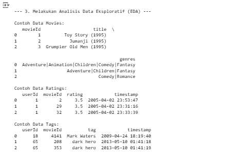
  - informasi umum (`info()`) dari setiap dataset untuk melihat struktur, tipe data, dan keberadaan nilai null.
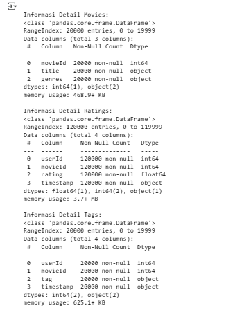
  
### 1. Statistik Dasar:
Bagian ini menghitung jumlah pengguna unik, jumlah film yang dirating, total film yang ada di dataset, dan total entri rating menggunakan fungsi nunique() dan len(). Statistik ini membantu memahami skala dataset.
```
# Statistik dasar
users_count = df_ratings['userId'].nunique()
movies_rated_count = df_ratings['movieId'].nunique()
movies_total_count = df_movies['movieId'].nunique()
ratings_count = len(df_ratings)

```
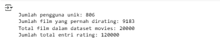

- Jumlah pengguna unik dalam data rating: 91 pengguna.
- Jumlah film yang pernah dirating dalam data rating: 2889 film.
- Total film dalam dataset movies: 20000 film.
- Jumlah total entri rating: 10000 entri.

### 2. Distribusi Rating:
Visualisasi ini menggunakan seaborn untuk membuat diagram batang yang menggambarkan distribusi nilai rating dalam dataset. Parameter palette memberikan warna yang menarik, dan grid() menambahkan garis bantu untuk membaca grafik dengan lebih mudah.

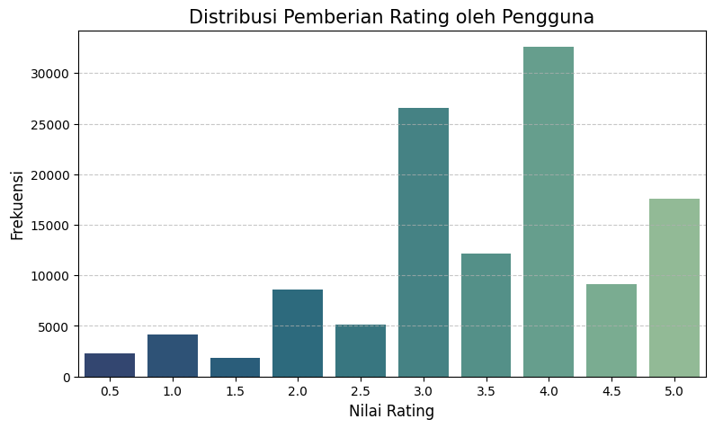

- Visualisasi menggunakan `countplot` menunjukkan bahwa rating **4.0** adalah yang paling sering diberikan, diikuti oleh **3.0** dan **3.5**. Rating rendah seperti **0.5** atau **1.5** lebih jarang diberikan. Ini mengindikasikan kecenderungan pengguna untuk memberikan rating yang positif atau netral.
- *Insight*: Distribusi rating ini penting untuk model Collaborative Filtering, karena model akan belajar dari pola rating ini.

### 3. Distribusi Jumlah Film per Genre:
Visualisasi ini digunakan untuk menampilkan jumlah film berdasarkan genre, membantu memahami dominasi genre tertentu dalam dataset. Prosesnya melibatkan pemisahan genre, penghitungan frekuensi, dan memplot data menggunakan diagram batang horizontal.

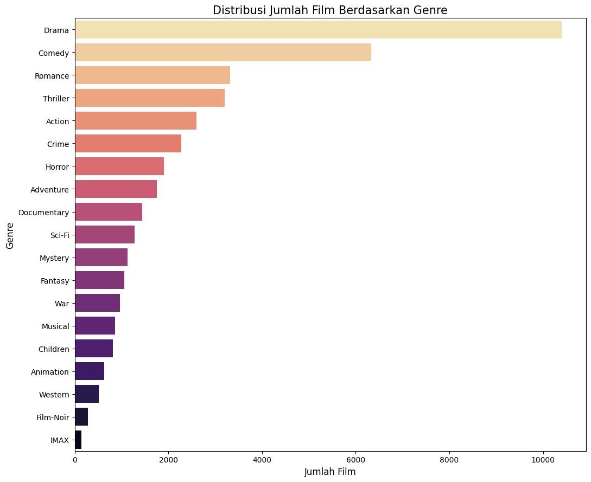

- Visualisasi menggunakan `barplot` setelah memecah dan menghitung genre menunjukkan bahwa genre **Drama** dan **Comedy** adalah yang paling dominan dalam dataset film. Genre seperti **Film-Noir** atau **IMAX** lebih jarang muncul.
- *Insight*: Dominasi genre tertentu dapat mempengaruhi rekomendasi berbasis konten. Model mungkin lebih cenderung merekomendasikan film dari genre populer jika tidak ada penanganan khusus.

### 4. Distribusi Jumlah Rating per Film:

Visualisasi ini menunjukkan berapa banyak film yang menerima sejumlah rating tertentu
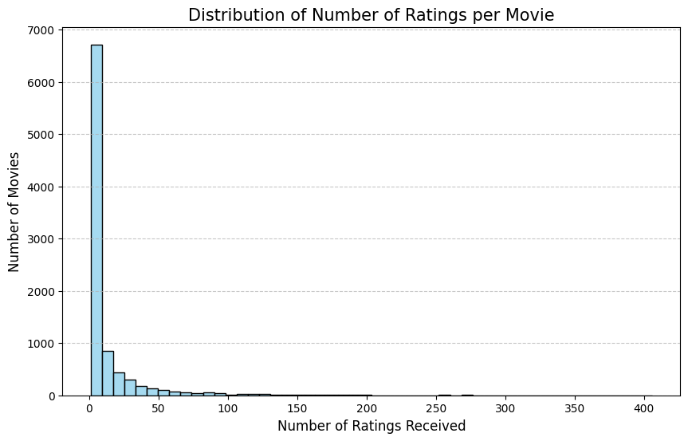

- Visualisasi menggunakan `histplot` menunjukkan bahwa sebagian besar film menerima sejumlah kecil rating (distribusi *long-tail*). Hanya sedikit film yang sangat populer dan menerima banyak rating.
- Rata-rata film menerima sekitar 3-4 rating, dengan standar deviasi yang cukup tinggi, menunjukkan variabilitas yang besar.
- *Insight*: Ini adalah karakteristik umum dataset rating dan dapat menjadi tantangan untuk model Collaborative Filtering, terutama untuk film dengan sedikit rating (item *cold start*).

### 5. Distribusi Jumlah Rating yang Diberikan oleh Pengguna:
Visualisasi menggunakan histplot juga menunjukkan distribusi long-tail, di mana sebagian besar pengguna memberikan sejumlah kecil rating, sementara beberapa pengguna sangat aktif.

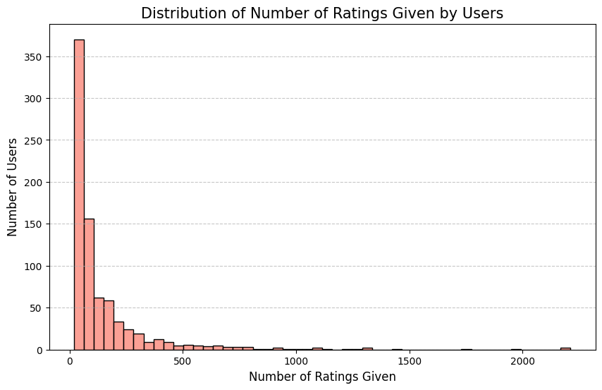

- Visualisasi menggunakan `histplot` juga menunjukkan distribusi *long-tail*, di mana sebagian besar pengguna memberikan sejumlah kecil rating, sementara beberapa pengguna sangat aktif.
- Rata-rata pengguna memberikan sekitar 110 rating, namun standar deviasinya juga tinggi.
- *Insight*: Pengguna yang sangat aktif memberikan lebih banyak informasi untuk model Collaborative Filtering, tetapi sistem juga harus mampu menangani pengguna dengan sedikit riwayat.

### 6. Distribusi Tahun Rilis Film:

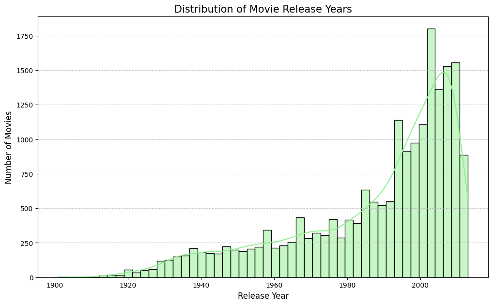

- Tahun rilis diekstrak dari judul film. Visualisasi `histplot` menunjukkan peningkatan jumlah film yang dirilis dari tahun ke tahun, dengan puncak di sekitar akhir 1990-an hingga awal 2000-an dalam subset data yang dimuat.
- *Insight*: Informasi tahun rilis dapat digunakan sebagai fitur tambahan atau untuk menganalisis tren.

### 7. Distribusi Temporal Rating:
Visualisasi ini menunjukkan jumlah film yang dirilis berdasarkan tahun

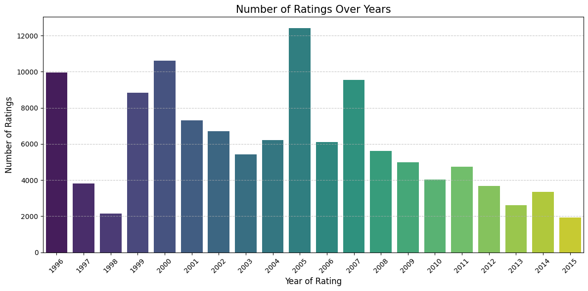

- Rating dikelompokkan berdasarkan tahun pemberian rating. Visualisasi `countplot` menunjukkan fluktuasi jumlah rating yang diberikan setiap tahunnya, dengan puncak pada tahun 2000 dalam subset data yang dianalisis.
- *Insight*: Pola temporal ini bisa menarik untuk analisis lebih lanjut, meskipun dalam notebook ini belum digunakan secara langsung dalam pemodelan.

EDA ini memberikan pemahaman yang baik tentang karakteristik dataset, distribusi fitur-fitur penting, dan potensi tantangan dalam membangun sistem rekomendasi.

---

## **Data Preparation**

Tahapan persiapan data dilakukan untuk membersihkan dan mentransformasi data mentah menjadi format yang sesuai untuk berbagai model rekomendasi. Langkah-langkah yang dilakukan adalah sebagai berikut:
**Pembuatan Salinan Data**
DataFrame asli (`ratings`, `movies`, `tags`) disalin ke DataFrame baru (`df_ratings_prep`, `df_movies_prep`, `df_tags_prep`) untuk memastikan data asli tetap utuh.
    - **Alasan**: Praktik yang baik dalam pengolahan data untuk menghindari modifikasi data sumber secara tidak sengaja.

### A. Pembersihan Data Awal:
Pembuatan salinan dan pembersihan data awal dilakukan untuk menjaga keutuhan data asli sekaligus memastikan kualitas data yang digunakan dalam analisis atau pembuatan model.
    - Menghapus baris dengan nilai yang hilang (`dropna()`) dari `df_ratings_prep`.
    - Menghapus baris dengan nilai yang hilang pada kolom `title` dan `genres` dari `df_movies_prep`.
    - Menghapus baris duplikat dari `df_ratings_prep`.
    - Menghapus baris duplikat berdasarkan `movieId` dari `df_movies_prep`, mempertahankan entri pertama (`keep='first'`).
    - **Alasan**: Nilai yang hilang dan duplikasi dapat mengganggu kualitas model dan analisis. Menghapusnya memastikan data lebih bersih dan konsisten.

### B. Pemrosesan Data Tags:
Pemrosesan data tag dilakukan dengan mengisi nilai kosong, standarisasi huruf kecil, dan agregasi tag unik per film untuk menciptakan fitur teks yang terstruktur.
```python
print("Memproses data tags...")
df_tags_prep['tag'] = df_tags_prep['tag'].fillna('').astype(str).str.lower()
aggregated_tags = df_tags_prep[df_tags_prep['tag'] != ''].groupby('movieId')['tag'].apply(
    lambda tags_list: ' '.join(sorted(list(set(tags_list))))
).reset_index()
aggregated_tags.rename(columns={'tag': 'movie_tags'}, inplace=True)
```
- Mengisi nilai yang hilang pada kolom `tag` di `df_tags_prep` dengan string kosong, mengonversinya ke tipe data string, dan mengubah semua tag menjadi huruf kecil (`lower()`).
- Mengagregasi tag untuk setiap `movieId`. Tag yang kosong diabaikan. Untuk setiap film, semua tag uniknya digabungkan menjadi satu string tunggal dengan spasi sebagai pemisah, setelah diurutkan. Hasilnya disimpan dalam DataFrame `aggregated_tags` dengan kolom `movie_tags`.
- **Alasan**: Mengubah tag menjadi huruf kecil dan mengagregasinya per film membantu dalam standarisasi dan pembuatan fitur konten yang lebih kaya. String kosong digunakan untuk tag yang hilang agar tidak error saat pemrosesan string.

### C. Persiapan Data untuk Content-Based Filtering:
Persiapan data untuk Content-Based Filtering melibatkan penggabungan dan pembersihan atribut genre serta tag film menjadi fitur teks gabungan konten_gabungan, yang akan digunakan untuk ekstraksi fitur TF-IDF.
```python
# Potongan kode dari notebook untuk membuat 'konten_gabungan' (cell 23)
movies_for_cb['konten_gabungan'] = (
    movies_for_cb['genres'].fillna('').astype(str).str.replace('|', ' ', regex=False) +
    ' ' +
    movies_for_cb['movie_tags']
)
movies_for_cb['konten_gabungan'] = movies_for_cb['konten_gabungan'].str.strip().str.replace(r'\s+', ' ', regex=True)
```
- Menggabungkan `df_movies` (yang berisi judul dan genre) dengan `aggregated_tags` berdasarkan `movieId` menggunakan *left merge*. Hasilnya disimpan di `movies_for_cb`.
- Mengisi nilai yang hilang pada `movie_tags` (hasil dari *left merge*) dengan string kosong.
- Membuat fitur gabungan bernama `konten_gabungan` yang merupakan konkatenasi dari `genres` (setelah mengganti `|` dengan spasi) dan `movie_tags`.
- Membersihkan `konten_gabungan` dengan menghapus spasi berlebih.
- Membuat DataFrame akhir `movies_content_base` yang hanya berisi `movieId`, `title`, `genres`, dan `konten_gabungan`, menghapus duplikat berdasarkan `movieId`, dan menjadikan `movieId` sebagai indeks.
- **Alasan**: `konten_gabungan` ini akan menjadi dasar untuk pembuatan fitur TF-IDF yang merepresentasikan konten film. Mengindeks berdasarkan `movieId` mempermudah pencarian film.

### D. TF-IDF Vectorization untuk Content-Based:
TF-IDF memastikan fitur yang lebih informatif mendominasi representasi konten, mendukung pengukuran kesamaan antar film secara efektif dengan mengurangi noise dan mengelola dimensi fitur.
```python
print("\nMenerapkan TF-IDF Vectorization pada 'konten_gabungan'...")
tfidf_processor = TfidfVectorizer(stop_words='english', min_df=3, max_df=0.8, ngram_range=(1,2)) # Penyesuaian parameter
tfidf_features_cb = tfidf_processor.fit_transform(movies_content_base['konten_gabungan'])
print(f"Dimensi Matriks Fitur TF-IDF (Content-Based): {tfidf_features_cb.shape}")
```
- Menggunakan `TfidfVectorizer` dari `sklearn.feature_extraction.text` untuk mengubah `konten_gabungan` menjadi matriks fitur TF-IDF (`tfidf_features_cb`).
- Parameter yang digunakan: `stop_words='english'` (menghapus kata umum bahasa Inggris), `min_df=3` (mengabaikan term yang muncul kurang dari 3 dokumen), `max_df=0.8` (mengabaikan term yang muncul di lebih dari 80% dokumen), `ngram_range=(1,2)` (mempertimbangkan unigram dan bigram).
- Dimensi matriks TF-IDF yang dihasilkan adalah (20000 film, 2466 fitur).
- **Alasan**: TF-IDF memberikan bobot pada kata-kata berdasarkan frekuensinya dalam dokumen dan keseluruhan korpus, sehingga kata-kata yang lebih informatif dan diskriminatif mendapatkan bobot lebih tinggi. Ini penting untuk mengukur similaritas konten antar film secara efektif. Parameter `min_df` dan `max_df` membantu mengurangi noise dan dimensi fitur.

### E. Persiapan Data untuk Collaborative Filtering (SVD - scikit-surprise):
Persiapan data untuk Collaborative Filtering dengan SVD menggunakan scikit-surprise mencakup langkah-langkah penyaringan pengguna dan film untuk mengurangi sparsitas data, memastikan kesesuaian format, serta membagi data menjadi set pelatihan dan pengujian guna membangun dan mengevaluasi model secara efektif.

- Menyaring pengguna: Hanya pengguna yang telah memberikan minimal 3 rating (`min_ratings_per_user = 3`) yang dipertimbangkan untuk membangun model SVD.
- Membuat DataFrame `df_ratings_cf_surprise` dengan memfilter `df_ratings` agar hanya berisi `movieId` yang ada di `movies_content_base` (memastikan film memiliki metadata) dan `userId` yang termasuk pengguna aktif.
- Menentukan skala rating minimum dan maksimum dari data rating yang sudah difilter.
- Membuat objek `Reader` dari `surprise` dengan skala rating yang sesuai.
- Memuat data rating (`userId`, `movieId`, `rating`) ke dalam format `Dataset` dari `surprise`.
- Membagi data menjadi set pelatihan (`trainset_surprise`) dan set pengujian (`testset_surprise`) dengan perbandingan 80:20.
- Jumlah data rating untuk SVD: 95390 untuk pelatihan, 23848 untuk pengujian.
- **Alasan**: Library `scikit-surprise` memerlukan format data spesifik. Menyaring pengguna dan film membantu mengurangi sparsity data dan fokus pada interaksi yang lebih informatif. Pembagian data latih-uji penting untuk evaluasi model.

### F. Persiapan Data untuk Neural Collaborative Filtering (NCF):
Persiapan data untuk NCF melibatkan penyaringan, encoding ID pengguna dan film ke integer, serta pembagian data menjadi set pelatihan dan validasi untuk memastikan kompatibilitas dengan model deep learning.

- **Pemilihan Data Rating**: Menggunakan `df_ratings_cf_surprise` (data yang sudah difilter untuk SVD) sebagai basis untuk data NCF. Ini memastikan konsistensi dan kualitas data.
- **Pemetaan ID Pengguna dan Film ke Integer Berurutan (Encoding)**:
    - `userId` unik dari `df_ratings_ncf` dipetakan ke integer mulai dari 0. Dibuat kamus `user_to_user_encoded_ncf` dan `user_encoded_to_user_ncf`.
    - `movieId` unik dari `df_ratings_ncf` (yang juga ada di `movies_content_base`) dipetakan ke integer mulai dari 0. Dibuat kamus `movie_to_movie_encoded_ncf` dan `movie_encoded_to_movie_ncf`.
    - DataFrame `df_ratings_ncf` diperbarui dengan kolom `user_encoded` dan `movie_encoded`.
    - Jumlah pengguna unik untuk NCF: 806. Jumlah film unik untuk NCF (setelah filter): 8908.
- **Alasan Encoding**: Model jaringan saraf, terutama lapisan embedding, memerlukan input integer kategorikal yang berurutan mulai dari 0. Memastikan `movieId` ada di `movies_content_base` penting agar informasi film bisa diambil saat memberikan rekomendasi.
- **Konversi Tipe Data dan Pembagian Data**:
    - Kolom `rating` di `df_ratings_ncf` diubah menjadi `float32`.
    - Baris dengan nilai `NaN` pada `user_encoded` atau `movie_encoded` (jika ada setelah mapping) dihapus.
    - Fitur `X_ncf` (pasangan `user_encoded`, `movie_encoded`) dan target `y_ncf` (rating) dibuat.
    - Data dibagi menjadi set pelatihan (`X_train_ncf`, `y_train_ncf`) dan set validasi (`X_val_ncf`, `y_val_ncf`) dengan perbandingan 90:10 menggunakan `sklearn_train_test_split` untuk digunakan oleh model TensorFlow/Keras.
    - Ukuran data training NCF: 107314, validasi NCF: 11924.
- **Alasan**: Tipe data `float32` umum digunakan dalam model deep learning untuk efisiensi. Pembagian data latih-validasi diperlukan untuk melatih dan memantau kinerja model NCF selama pelatihan, misalnya untuk *early stopping*.

Proses ini mendukung pelatihan model secara efisien dengan memastikan data berkualitas, format kompatibel, dan pembagian data yang memungkinkan evaluasi performa model.

Semua langkah persiapan data ini krusial untuk memastikan model-model rekomendasi dapat dilatih dengan data yang berkualitas dan dalam format yang benar.

---

## **Modeling & Result**

Tahapan ini membahas mengenai model sistem rekomendasi yang dibuat untuk menyelesaikan permasalahan.

### A. Content-Based Filtering

Model ini merekomendasikan item berdasarkan kemiripan atributnya dengan item yang telah disukai pengguna di masa lalu.

**1. Algoritma yang Digunakan:**
- **TF-IDF (Term Frequency-Inverse Document Frequency):** Digunakan untuk mengubah data tekstual dari fitur film (seperti genre dan tag) menjadi representasi vektor numerik. TF-IDF memberikan bobot pada kata-kata berdasarkan frekuensinya dalam satu dokumen (film) dan seberapa jarang kata tersebut muncul di seluruh korpus dokumen (kumpulan film).
- **Cosine Similarity:** Setelah film direpresentasikan sebagai vektor TF-IDF, Cosine Similarity digunakan untuk menghitung kemiripan antara dua vektor film. Skor similaritas berkisar antara -1 hingga 1 (atau 0 hingga 1 untuk vektor non-negatif seperti output TF-IDF), di mana skor yang lebih tinggi menunjukkan kemiripan yang lebih besar.

**2. Perhitungan Matriks Similaritas (Cosine Similarity)**:
```python
# Potongan kode dari notebook untuk Cosine Similarity (cell 30)
cosine_similarity_matrix_cb = cosine_similarity(tfidf_features_cb, tfidf_features_cb)
```

- Setelah mendapatkan representasi TF-IDF dari konten film (`tfidf_features_cb`), kesamaan kosinus dihitung antar semua pasangan film.
- Hasilnya adalah `cosine_similarity_matrix_cb` dengan dimensi (20000, 20000), di mana setiap elemen `(i, j)` menunjukkan skor similaritas antara film `i` dan film `j`.
- **Kelebihan**: Sederhana, interpretatif, dan tidak memerlukan data pengguna lain (mengatasi *user cold start* dan *sparsity*). Dapat merekomendasikan item baru selama kontennya tersedia.
- **Kekurangan**: Terbatas pada fitur konten yang ada (jika konten tidak kaya, rekomendasi kurang baik). Cenderung merekomendasikan item yang sangat mirip (*serendipity* rendah). Memerlukan *domain knowledge* untuk *feature engineering*.

**3. Pemetaan Judul Film ke Index Matriks**:
- Dibuat dua pemetaan (lookup Series): `title_to_movieid_lookup_cb` (dari judul film ke `movieId`) dan `movieid_to_title_lookup_cb` (dari `movieId` ke judul film).
    - Pemetaan ini menggunakan `movies_content_base` yang sudah diindeks oleh `movieId`.
- **Tujuan**: Memudahkan pengguna untuk memasukkan judul film sebagai input dan sistem dapat menemukan `movieId` yang sesuai untuk mengambil skor similaritas dari matriks.

**4. Top-N Recommendation**:
- Fungsi `dapatkan_rekomendasi_content_based` mengambil judul film sebagai input.
- Mencari `movieId` dari judul, kemudian posisi film tersebut dalam matriks similaritas.
- Mengambil baris yang sesuai dari matriks similaritas, yang berisi skor similaritas film input dengan semua film lain.
- Mengurutkan film berdasarkan skor similaritas secara menurun dan mengambil N film teratas (tidak termasuk film input itu sendiri) sebagai rekomendasi.

**5. Kelebihan dan Kekurangan Content-Based Filtering:**
- Kelebihan:
    - Interpretatif dan Sederhana: Logika di balik rekomendasi mudah dipahami.
    - Tidak Perlu Data Pengguna Lain: Mengatasi masalah user cold start (untuk rekomendasi berbasis item, bukan pengguna baru tanpa interaksi) dan data sparsity (kelangkaan data rating).
    - Rekomendasi Item Baru: Dapat merekomendasikan item baru selama konten/fiturnya tersedia (item cold start untuk item baru).
    - Personalisasi Berdasarkan Preferensi Eksplisit: Rekomendasi disesuaikan dengan konten item yang telah disukai pengguna.
- Kekurangan:
    - Keterbatasan Fitur Konten: Jika fitur konten tidak kaya atau deskriptif, kualitas rekomendasi akan menurun.
    - Kurangnya Serendipity dan Novelty: Cenderung merekomendasikan item yang sangat mirip dengan yang sudah disukai pengguna, sehingga kurang memberikan kejutan atau variasi.
    - Perlu Feature Engineering: Memerlukan domain knowledge yang baik untuk mengekstrak dan merekayasa fitur yang relevan dari konten.
    - Over-specialization: Pengguna mungkin terjebak dalam "filter bubble", hanya melihat item yang mirip dengan riwayat mereka.

**6. Contoh Rekomendasi Berbasis Content-Based**
Berikut adalah contoh rekomendasi Content-Based untuk film "Bugsy (1991)":

| Peringkat | movieId | Title                                               | Genres                                 | Skor Similaritas |
|-----------|---------|-----------------------------------------------------|--------------------------------------|-------------------|
| 1         | 2023    | Godfather: Part III, The (1990)                     | Crime , Drama , Mystery , Thriller    | 0.5905            |
| 2         | 30      | Shanghai Triad (Yao a yao yao dao waipo qiao) (1995)| Crime , Drama                         | 0.5559            |
| 3         | 117     | Young Poisoner's Handbook, The (1995)               | Crime , Drama                         | 0.5559            |
| 4         | 245     | Glass Shield, The (1994)                            | Crime , Drama                         | 0.5559            |
| 5         | 247     | Heavenly Creatures (1994)                           | Crime , Drama                         | 0.5559            |


Film-film yang direkomendasikan memiliki genre yang sama (Crime, Drama) dengan "Bugsy (1991)" dan skor similaritas yang tinggi.

**7. Analisis Model Content-Based Filtering:**
- Dalam proyek ini, Content-Based Filtering diimplementasikan dengan memanfaatkan fitur genre dan tag film. Model ini efektif dalam mengidentifikasi dan merekomendasikan film-film yang memiliki kesamaan tematik atau atributual dengan film referensi.
- Contoh rekomendasi untuk "Bugsy (1991)" menunjukkan bahwa film-film yang disarankan memang berbagi genre utama (Crime, Drama), yang sesuai dengan cara kerja model ini.
- Pendekatan ini cocok untuk pengguna yang memiliki preferensi jelas terhadap genre atau tipe konten tertentu dan ingin menjelajahi lebih banyak film serupa. Keterbatasannya adalah kurang bisa mengeksplorasi film di luar zona nyaman pengguna jika hanya mengandalkan kemiripan konten.

### B. Collaborative Filtering (SVD)

Model ini merekomendasikan item berdasarkan pola rating dari pengguna lain yang memiliki preferensi serupa.

**1. Algoritma & Model SVD:**
```python
# Potongan kode dari notebook untuk inisialisasi dan pelatihan SVD (cell 32)
svd_model = SVD(n_factors=100, n_epochs=25, lr_all=0.005, reg_all=0.04, random_state=42)
if trainset_surprise:
    svd_model.fit(trainset_surprise)
```
- Model SVD (Singular Value Decomposition) dari library `scikit-surprise` digunakan.
- Parameter yang digunakan: `n_factors=100` (jumlah faktor laten), `n_epochs=25` (jumlah iterasi pelatihan), `lr_all=0.005` (learning rate), `reg_all=0.04` (faktor regularisasi).
- Model dilatih menggunakan `trainset_surprise`.

**2. Top-N Recommendation:**
- Fungsi `dapatkan_rekomendasi_svd` mengambil ID pengguna sebagai input.
- Mengidentifikasi film-film yang belum pernah dirating oleh pengguna tersebut dari `trainset_surprise`.
- Memprediksi rating yang akan diberikan pengguna untuk setiap film yang belum dirating menggunakan model SVD yang telah dilatih.
- Mengurutkan film berdasarkan prediksi rating tertinggi dan mengambil N film teratas sebagai rekomendasi.

**3. Kelebihan dan Kekurangan Collaborative Filtering (SVD):**
- Kelebihan:
    - Menemukan Pola Laten: Mampu menemukan pola dan preferensi tersembunyi dalam data rating yang tidak terlihat oleh Content-Based.
    - Tidak Perlu Fitur Konten: Tidak bergantung pada fitur eksplisit dari item, hanya memerlukan data interaksi (rating).
    - Serendipity Lebih Tinggi: Seringkali memberikan rekomendasi yang lebih personal, beragam, dan mengejutkan namun tetap relevan.
- Kekurangan:
    - Cold Start: Menderita masalah user cold start (sulit memberikan rekomendasi untuk pengguna baru dengan sedikit atau tanpa riwayat rating) dan item cold start (sulit merekomendasikan item baru yang belum memiliki rating).
    - Data Sparsity: Kinerja dapat menurun jika matriks rating sangat jarang (banyak pengguna hanya memberi rating pada sedikit item).
    - Popularity Bias: Cenderung merekomendasikan item populer yang sudah banyak mendapatkan rating.

**4. Contoh Result Rekomendasi Berbasis Kolaboratif (SVD)**
Berikut adalah contoh rekomendasi SVD untuk beberapa pengguna sampel (misalnya, Pengguna ID 61 ):

| Peringkat | movieId | Title                        | Genres                           | Prediksi Rating |
|-----------|---------|------------------------------|----------------------------------|-----------------|
| 1         | 858     | Godfather, The (1972)       | Crime , Drama                    | 4.699           |
| 2         | 296     | Pulp Fiction (1994)         | Comedy , Crime , Drama , Thriller | 4.545           |
| 3         | 58559   | Dark Knight, The (2008)     | Action , Crime , Drama , IMAX     | 4.478           |
| 4         | 1221    | Godfather: Part II, The (1974)| Crime , Drama                    | 4.452           |
| 5         | 318     | Shawshank Redemption, The (1994)| Crime , Drama                | 4.353           |

**Result Contoh Rekomendasi (SVD) untuk Pengguna ID: 746 (Top 5)**

------------------------------------------------------------------------------------------
| Peringkat | movieId |                                                    Title                                                   |                     Genres                     | Prediksi Rating |
|-----------|---------|----------------------------------------------------------------------------------------------------------------|-----------------------------------------------|-----------------|
|         1 |     318 | Shawshank Redemption, The (1994)                                                                             | Crime,Drama                                   |           4.433 |
|         2 |   91529 | Dark Knight Rises, The (2012)                                                                                | Action,Adventure,Crime,IMAX                  |           4.382 |
|         3 |    4993 | Lord of the Rings: The Fellowship of the Ring, The (2001)                                                   | Adventure,Fantasy                            |           4.352 |
|         4 |     260 | Star Wars: Episode IV - A New Hope (1977)                                                                   | Action,Adventure,Sci-Fi                      |           4.304 |
|         5 |      50 | Usual Suspects, The (1995)                                                                                  | Crime,Mystery,Thriller                       |           4.302 |
------------------------------------------------------------------------------------------

**Rekomendasi Collaborative (SVD) untuk Pengguna ID: 261 (Top 5)**

------------------------------------------------------------------------------------------
| Peringkat | movieId |                                                    Title                                                   |                     Genres                     | Prediksi Rating |
|-----------|---------|----------------------------------------------------------------------------------------------------------------|-----------------------------------------------|-----------------|
|         1 |    1284 | Big Sleep, The (1946)                                                                                      | Crime,Film-Noir,Mystery                      |           4.009 |
|         2 |    1221 | Godfather: Part II, The (1974)                                                                             | Crime,Drama                                   |           3.959 |
|         3 |     318 | Shawshank Redemption, The (1994)                                                                           | Crime,Drama                                   |           3.939 |
|         4 |    1193 | One Flew Over the Cuckoo's Nest (1975)                                                                     | Drama                                        |           3.912 |
|         5 |    2019 | Seven Samurai (Shichinin no samurai) (1954)                                                                | Action,Adventure,Drama                       |           3.885 |
------------------------------------------------------------------------------------------

Rekomendasi ini didasarkan pada prediksi rating SVD untuk film yang belum ditonton oleh pengguna tersebut.

**5. Contoh Result Prediksi Rating Spesifik**
- **SVD**: Prediksi rating (SVD) untuk Pengguna 61 pada film 'Crimes and Misdemeanors (1989)' (ID: 2973) adalah 3.707.

**6. Analisis Model Collaborative Filtering (SVD):**
- SVD dalam proyek ini bertujuan untuk menangkap preferensi pengguna berdasarkan perilaku kolektif. Dengan memfaktorkan matriks rating, model mempelajari representasi laten (embedding) untuk pengguna dan item. Kedekatan dalam ruang laten ini mengindikasikan kesamaan preferensi atau karakteristik.
- Rekomendasi yang dihasilkan, seperti untuk Pengguna ID 61, mencerminkan film-film yang secara umum populer dan mendapat rating tinggi dari pengguna dengan pola serupa, seperti "The Godfather" dan "Pulp Fiction".
- Model ini efektif untuk pengguna dengan riwayat rating yang cukup, namun akan kesulitan bagi pengguna baru atau untuk merekomendasikan film yang baru rilis dan belum banyak di-rating.

### C. Collaborative Filtering (Neural Collaborative Filtering - NCF)

Model ini menggunakan arsitektur jaringan saraf untuk memodelkan interaksi pengguna-item.

**1. Definisi Algotiritma & Model RecommenderNCF :**
```python
# Potongan kode definisi model NCF (RecommenderNCF - cell 33)
def RecommenderNCF(num_users, num_movies, embedding_size=50, mlp_layers_sizes=[64, 32, 16, 8]):
    user_input = layers.Input(shape=(1,), dtype='int32', name='user_input')
    movie_input = layers.Input(shape=(1,), dtype='int32', name='movie_input')
    
    user_embedding_gmf = layers.Embedding(num_users, embedding_size, ... , name='user_embedding_gmf')(user_input) # noqa: F811
    movie_embedding_gmf = layers.Embedding(num_movies, embedding_size, ... , name='movie_embedding_gmf')(movie_input) # noqa: F811
    gmf_vector = layers.Multiply(name='gmf_multiply')([user_embedding_gmf, movie_embedding_gmf])
    gmf_vector = layers.Flatten()(gmf_vector)
    
    user_embedding_mlp = layers.Embedding(num_users, embedding_size, ... , name='user_embedding_mlp')(user_input) # noqa: F811
    movie_embedding_mlp = layers.Embedding(num_movies, embedding_size, ... , name='movie_embedding_mlp')(movie_input) # noqa: F811
    mlp_vector = layers.Concatenate(name='mlp_concatenate')([user_embedding_mlp, movie_embedding_mlp])
    mlp_vector = layers.Flatten()(mlp_vector)
    for layer_size in mlp_layers_sizes:
        mlp_vector = layers.Dense(layer_size, activation='relu', ...)(mlp_vector) # noqa: F811
        mlp_vector = layers.Dropout(0.3)(mlp_vector)
    
    concat_vector = layers.Concatenate(name='concat_gmf_mlp')([gmf_vector, mlp_vector])
    output_layer = layers.Dense(1, kernel_initializer='lecun_uniform', name='output')(concat_vector)
    model = Model(inputs=[user_input, movie_input], outputs=output_layer) # noqa: F811
    return model
```
- Model NCF yang diimplementasikan memiliki dua jalur utama yang dipelajari secara bersamaan:
    - **Generalized Matrix Factorization (GMF) Path**: Mempelajari interaksi linear antara embedding pengguna dan embedding film melalui perkalian elemen-bijaksana (element-wise product).
    - **Multi-Layer Perceptron (MLP) Path**: Menggabungkan (concatenate) embedding pengguna dan embedding film, kemudian melewatkannya melalui beberapa lapisan dense (fully connected) dengan aktivasi ReLU untuk mempelajari interaksi non-linear yang lebih kompleks. Dropout digunakan untuk regularisasi.
- Output dari jalur GMF dan MLP kemudian digabungkan (concatenate) dan dilewatkan ke lapisan output dense tunggal untuk memprediksi rating.
- Lapisan embedding menggunakan inisialisasi `he_normal` dan regularisasi L2.

**2. Pelatihan Model NCF**:
- Model dikompilasi menggunakan optimizer Adam, fungsi loss Mean Squared Error (MSE), dan metrik Root Mean Squared Error (RMSE).
- Dilatih menggunakan data `X_train_ncf` (pasangan user_encoded, movie_encoded) dan `y_train_ncf` (rating) dengan ukuran batch 128 dan 15 epoch.
- Menggunakan *callback* `EarlyStopping` untuk menghentikan pelatihan jika *validation loss* tidak membaik setelah 3 epoch, dan mengembalikan bobot terbaik.
- Grafik loss pelatihan dan validasi diplot untuk memantau proses pelatihan.

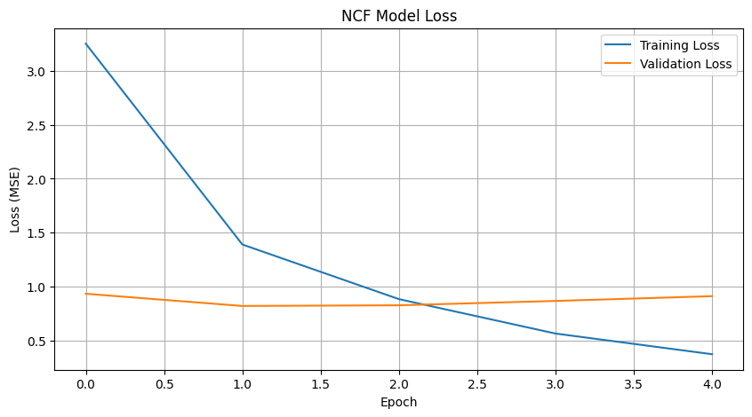

**3. Top-N Recommendation**:
- Fungsi `dapatkan_rekomendasi_ncf` mengambil ID pengguna asli sebagai input.
- Mengubah ID pengguna asli menjadi ID ter-encode.
- Mengidentifikasi film-film yang belum dirating oleh pengguna tersebut dari `df_ratings_ncf` (yang berisi ID ter-encode).
- Membuat array input pengguna (ID pengguna ter-encode diulang) dan array input film (ID film ter-encode yang belum dirating).
 Memprediksi rating untuk film-film tersebut menggunakan model NCF yang telah dilatih.
- Mengurutkan film berdasarkan prediksi rating tertinggi dan mengambil N film teratas, kemudian mengembalikan informasi film (judul, genre) bersama dengan prediksi ratingnya.

**4. Kelebihan dan Kekurangan Neural Collaborative Filtering (NCF):**
- Kelebihan:
    - Menangkap Interaksi Non-Linear: Mampu menangkap interaksi yang kompleks dan non-linear antara pengguna dan item, yang mungkin terlewat oleh model faktorisasi matriks linear seperti SVD.
    - Arsitektur Fleksibel: Arsitektur jaringan saraf dapat disesuaikan dan diperluas dengan mudah (misalnya, menambahkan lebih banyak lapisan, jenis lapisan berbeda, atau fitur tambahan).
    - Potensi Performa Lebih Baik: Dengan data yang cukup dan tuning yang tepat, NCF berpotensi memberikan akurasi prediksi yang lebih tinggi dibandingkan model tradisional.
- Kekurangan:
    - Cold Start dan Sparsity: Sama seperti model CF lainnya, menderita masalah cold start (pengguna/item baru) dan sensitif terhadap kelangkaan data.
    - Kompleksitas dan Kebutuhan Data: Lebih kompleks untuk dilatih, memerlukan lebih banyak data, dan hyperparameter tuning yang lebih ekstensif dibandingkan SVD.
    - Risiko Overfitting: Jaringan saraf yang dalam rentan terhadap overfitting, memerlukan teknik regularisasi yang baik (seperti dropout yang digunakan di sini).
    - Interpretability Rendah: Sifat black-box dari jaringan saraf membuatnya lebih sulit untuk menginterpretasikan mengapa rekomendasi tertentu dibuat

**5. Contoh Result Rekomendasi Berbasis Kolaboratif (NCF)**
Berikut adalah contoh rekomendasi NCF untuk pengguna yang sama (misalnya, Pengguna ID 61 ):

| Peringkat | movieId | Title                                               | Genres                           | Prediksi Rating (NCF) |
|-----------|---------|-----------------------------------------------------|----------------------------------|-----------------------|
| 1         | 318     | Shawshank Redemption, The (1994)                    | Crime , Drama                    | 4.948                 |
| 2         | 1221    | Godfather: Part II, The (1974)                      | Crime , Drama                    | 4.711                 |
| 3         | 1193    | One Flew Over the Cuckoo's Nest (1975)              | Drama                           | 4.663                 |
| 4         | 1196    | Star Wars: Episode V - The Empire Strikes Back (1980)| Action , Adventure , Sci-Fi      | 4.617                 |
| 5         | 858     | Godfather, The (1972)                               | Crime , Drama                    | 4.581                 |

**Rekomendasi Neural Collaborative Filtering (NCF) untuk Pengguna ID: 746 (Top 5)**

-----------------------------------------------------------------------------------------------
| Peringkat | movieId |                                                   title                                                  |                          genres                          | Prediksi Rating (NCF) |
|-----------|---------|---------------------------------------------------------------------------------------------------------|---------------------------------------------------------|------------------------|
|         1 |     318 | Shawshank Redemption, The (1994)                                                                        | Crime,Drama                                             |                  4.007 |
|         2 |     778 | Trainspotting (1996)                                                                                    | Comedy,Crime,Drama                                      |                  3.981 |
|         3 |   44555 | Lives of Others, The (Das leben der Anderen) (2006)                                                     | Drama|Romance,Thriller                                  |                  3.932 |
|         4 |    7153 | Lord of the Rings: The Return of the King, The (2003)                                                   | Action,Adventure,Drama,Fantasy                         |                  3.925 |
|         5 |     593 | Silence of the Lambs, The (1991)                                                                        | Crime,Horror,Thriller                                   |                  3.910 |
-----------------------------------------------------------------------------------------------
Rekomendasi NCF juga berdasarkan prediksi rating, namun menggunakan model jaringan saraf.

**6. Contoh Prediksi Rating Spesifik NCF**
- **NCF**: Prediksi rating (NCF) untuk Pengguna 61 pada film 'Ace Ventura: Pet Detective (1994)' (ID: 344) adalah 2.415.

**7. Analisis Model Neural Collaborative Filtering (NCF):**
- NCF diadopsi dalam proyek ini sebagai pendekatan Collaborative Filtering yang lebih canggih, dengan harapan dapat memodelkan hubungan non-linear antara pengguna dan item yang tidak dapat ditangkap oleh SVD.
- Kombinasi jalur GMF (untuk interaksi linear) dan MLP (untuk interaksi non-linear) bertujuan untuk menciptakan model yang lebih kuat dan ekspresif.
- Hasil rekomendasi untuk Pengguna ID 61 menunjukkan film-film dengan rating prediksi yang tinggi, beberapa di antaranya tumpang tindih dengan SVD namun ada juga yang berbeda, menandakan kemampuan NCF untuk menangkap pola yang sedikit berbeda.
- Meskipun lebih kompleks, penggunaan EarlyStopping dan dropout membantu dalam mengelola pelatihan dan mengurangi risiko overfitting. Kinerjanya sangat bergantung pada kualitas data dan pemilihan hyperparameter.

### D. Model Hybrid Recommender

Model ini menggabungkan hasil dari SVD (Collaborative) dan Content-Based untuk memberikan rekomendasi yang lebih seimbang.

**1. Algoritma yang Digunakan:**
- Weighted Hybridization (Pembobotan Campuran): Pendekatan ini menggabungkan skor atau daftar peringkat dari dua atau lebih sistem rekomendasi individual. Setiap sistem kontributor diberikan bobot yang menentukan pengaruhnya terhadap hasil akhir.
-  Dalam implementasi ini:
    - Skor prediksi rating dari SVD (Collaborative Filtering).
    - Skor similaritas dari Content-Based Filtering.
    - Skor SVD dinormalisasi ke rentang [0,1] agar sebanding dengan skor similaritas kosinus dari Content-Based.
    - Skor akhir dihitung sebagai kombinasi linear berbobot: hybrid_score = (w_svd * normalized_svd_score) + (w_cb * cb_score). Bobot w_svd dan w_cb dapat disesuaikan untuk menekankan salah satu pendekatan.

 **2. Penggabungan Skor:**
- Fungsi `dapatkan_rekomendasi_hybrid` mengambil ID pengguna dan judul film referensi (untuk Content-Based) sebagai input.
- Mendapatkan daftar rekomendasi dari SVD (skor prediksi rating) dan Content-Based (skor similaritas).
- Skor SVD dinormalisasi ke rentang 0-1 agar sebanding dengan skor similaritas kosinus.
- DataFrame rekomendasi dari kedua model digabungkan. Film yang tidak ada di salah satu model diberi skor 0 untuk model tersebut.
- Skor hybrid dihitung sebagai kombinasi linear berbobot dari skor SVD yang dinormalisasi dan skor Content-Based (`hybrid_score = (w_svd * norm_svd_score) + (w_cb * cb_score)`). Bobot `w_svd` dan `w_cb` dapat disesuaikan.


**3. Top-N Recommendation:**
- Film-film diurutkan berdasarkan `hybrid_score` tertinggi.
- N film teratas diambil sebagai rekomendasi hybrid akhir.

**4. Kelebihan dan Kekurangan Model Hybrid Recommender:**
- Kelebihan:
    - Mengatasi Kelemahan Model Individual: Dapat menutupi kekurangan dari masing-masing komponen. Misalnya, Content-Based dapat membantu masalah item cold start untuk SVD, sementara SVD dapat memberikan serendipity yang tidak dimiliki Content-Based.
    - Peningkatan Akurasi dan Kualitas: Seringkali menghasilkan akurasi prediksi yang lebih baik dan kualitas rekomendasi yang lebih seimbang (misalnya, dalam hal coverage, novelty, serendipity).
    - Fleksibilitas: Dapat disesuaikan dengan kebutuhan spesifik melalui pemilihan model komponen dan strategi penggabungan (misalnya, pembobotan yang berbeda).
- Kekurangan:
    - Kompleksitas Implementasi: Lebih kompleks untuk dirancang, diimplementasikan, dan di-debug dibandingkan model tunggal.
    - Tantangan Tuning: Menentukan bobot yang optimal untuk menggabungkan skor dari model-model berbeda bisa menjadi tantangan dan mungkin memerlukan eksperimen atau teknik pembelajaran adaptif.
    - Penyebaran Error: Jika salah satu model dasar memiliki kinerja yang sangat buruk atau menghasilkan error, hal itu dapat berdampak negatif pada kinerja model hybrid secara keseluruhan.

**5. Analisis Model Hybrid Recommender:**
- Model hybrid dalam proyek ini menggunakan pendekatan pembobotan sederhana untuk menggabungkan kekuatan SVD (yang menangkap pola kolaboratif dan dapat menghasilkan rekomendasi yang lebih beragam) dengan Content-Based Filtering (yang baik dalam merekomendasikan item serupa dan mengatasi item cold start).
- Normalisasi skor SVD sebelum penggabungan adalah langkah penting untuk memastikan kedua jenis skor berada pada skala yang sebanding.
- Dengan memvariasikan bobot (w_svd dan w_cb), sistem dapat disesuaikan untuk lebih mencondongkan rekomendasi ke arah preferensi kolaboratif atau kemiripan konten. Contoh dengan bobot berbeda menunjukkan bagaimana hal ini mempengaruhi hasil rekomendasi, di mana bobot yang lebih tinggi untuk CB akan menghasilkan rekomendasi yang lebih mirip dengan film referensi CB.
- Pendekatan ini menunjukkan cara praktis untuk meningkatkan kualitas rekomendasi dengan memanfaatkan sinergi antar model yang berbeda.

**6. Contoh Result Rekomendasi Hybrid**
Berikut adalah contoh rekomendasi Hybrid untuk Pengguna ID 61, dengan film referensi Content-Based "Clueless (1995)":

REKOMENDASI HYBRID untuk Pengguna ID: 61, Ref CB: 'Clueless (1995)' (Top 5)
Bobot: SVD=0.6, CB=0.4
| Peringkat | movieId | Title                        | Genres                           | Hybrid Score | Norm SVD Score | CB Score |
|-----------|---------|------------------------------|----------------------------------|--------------|----------------|----------|
| 1         | 858     | Godfather, The (1972)       | Crime , Drama                    | 0.5599       | 0.933          | 0.000    |
| 2         | 296     | Pulp Fiction (1994)         | Comedy , Crime , Drama , Thriller | 0.5393       | 0.899          | 0.000    |
| 3         | 58559   | Dark Knight, The (2008)     | Action , Crime , Drama , IMAX     | 0.5303       | 0.884          | 0.000    |
| 4         | 1221    | Godfather: Part II, The (1974)| Crime , Drama                    | 0.5269       | 0.878          | 0.000    |
| 5         | 318     | Shawshank Redemption, The (1994)| Crime , Drama                | 0.5138       | 0.856          | 0.000    |

Dengan bobot berbeda (SVD=0.3, CB=0.7):

| Peringkat | movieId | Title                      | Genres                     | Hybrid Score | Norm SVD Score | CB Score |
|-----------|---------|----------------------------|----------------------------|--------------|----------------|----------|
| 1         | 26958   | Emma (1996)               | Romance                    | 0.4901       | 0.000          | 0.700    |
| 2         | 3079    | Mansfield Park (1999)     | Comedy , Drama , Romance  | 0.4787       | 0.000          | 0.684    |
| 3         | 31694   | Bride & Prejudice (2004)  | Comedy , Musical , Romance| 0.4557       | 0.000          | 0.651    |
| 4         | 838     | Emma (1996)               | Comedy , Drama , Romance  | 0.4491       | 0.000          | 0.642    |
| 5         | 74508   | Persuasion (2007)         | Drama , Romance             | 0.4177       | 0.000          | 0.597    |


Demonstrasi ini menunjukkan bagaimana berbagai model dapat memberikan rekomendasi yang berbeda dan bagaimana model hybrid dapat menyesuaikan hasil berdasarkan pembobotan.


---

## **Evaluation**

Evaluasi dilakukan untuk mengukur kinerja dari model-model rekomendasi yang telah dibangun.

### Metrik Evaluasi yang Digunakan

1.  **Root Mean Squared Error (RMSE)**:
    - **Formula**: $RMSE = \sqrt{\frac{1}{N} \sum_{i=1}^{N} (y_i - \hat{y}_i)^2}$
        - $N$: Jumlah rating yang diprediksi.
        - $y_i$: Rating aktual.
        - $\hat{y}_i$: Rating prediksi.
    - **Cara Kerja**: RMSE mengukur rata-rata magnitudo error prediksi rating. Semakin kecil nilai RMSE, semakin baik kinerja model dalam memprediksi rating secara akurat. RMSE memberikan bobot lebih besar pada error yang besar karena adanya pengkuadratan. Digunakan untuk model SVD dan NCF.

2.  **Mean Absolute Error (MAE)**:
    - **Formula**: $MAE = \frac{1}{N} \sum_{i=1}^{N} |y_i - \hat{y}_i|$
    - **Cara Kerja**: MAE mengukur rata-rata magnitudo absolut dari error. Sama seperti RMSE, nilai MAE yang lebih kecil menunjukkan kinerja model yang lebih baik. MAE lebih mudah diinterpretasikan karena berada dalam skala yang sama dengan rating asli. Digunakan untuk model SVD dan NCF.

3.  **Precision@K (Simulasi)**:
    - **Formula**: $Precision@K = \frac{\text{Jumlah item relevan yang direkomendasikan di posisi K teratas}}{K}$
    - **Cara Kerja**: Precision@K mengukur seberapa banyak item yang direkomendasikan dalam K posisi teratas yang benar-benar relevan bagi pengguna. Dalam simulasi ini:
        - Item "relevan" bagi pengguna diasumsikan sebagai film yang telah diberi rating tinggi (misalnya, >= 4.0) oleh pengguna tersebut di masa lalu.
        - Untuk **Content-Based**, sebuah film yang disukai pengguna diambil sebagai referensi, lalu N rekomendasi dihasilkan. Precision@K dihitung dengan melihat berapa banyak dari K rekomendasi teratas yang juga termasuk dalam daftar film yang disukai pengguna (tidak termasuk film referensi).
        - Untuk **Hybrid**, prosesnya serupa, di mana rekomendasi hybrid dievaluasi terhadap daftar film yang disukai pengguna.
    - Semakin tinggi nilai Precision@K, semakin baik kemampuan model dalam merekomendasikan item yang relevan di posisi teratas.
---

### Hasil Evaluasi

**1. Model SVD (Collaborative Filtering):**

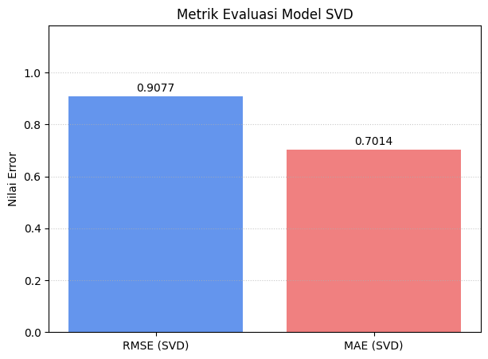

- Dievaluasi pada `testset_surprise`.
- **RMSE**: 0.9077.
- **MAE**: 0.7014.
- *Interpretasi*: Nilai RMSE dan MAE ini menunjukkan tingkat error rata-rata dari prediksi rating SVD. Semakin mendekati 0, semakin baik.

**2. Model Neural Collaborative Filtering (NCF):**

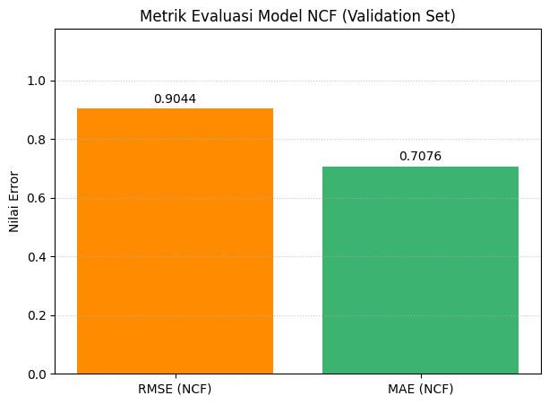

- Dievaluasi pada set validasi (`X_val_ncf`, `y_val_ncf`).
- **Loss (MSE) pada Validation Set**: 0.8209.
- **RMSE pada Validation Set**: 0.9044.
- **MAE pada Validation Set**: 0.7076.
- *Interpretasi*: Kinerja NCF pada set validasi menunjukkan error yang sedikit lebih tinggi dibandingkan SVD pada test setnya untuk RMSE, namun lebih rendah untuk MAE (perlu diingat bahwa set data evaluasinya mungkin berbeda). Grafik loss pelatihan menunjukkan model NCF belajar dengan baik, dengan loss validasi yang cukup stabil setelah beberapa epoch, mengindikasikan *early stopping* mungkin telah bekerja dengan baik untuk mencegah *overfitting* yang parah.

**3. Model Content-Based Filtering (Simulasi Precision@K)**:

```
Mengevaluasi Model Content-Based Filtering (Precision@K)...
Content-Based Filtering (Simulasi) - Rata-rata Precision@5: 0.1800
```
- Dievaluasi menggunakan fungsi `hitung_precision_at_k_cb` dengan `K_untuk_precision=5` pada sampel 10 pengguna (dari sebelumnya 20).
- **Rata-rata Precision@5**: 0.1800.
- *Interpretasi*: Ini berarti dari 5 film yang direkomendasikan, rata-rata sekitar 0.18 * 5 = 0.9 film relevan bagi pengguna (dalam konteks simulasi ini). Nilai ini mungkin tampak rendah, tetapi evaluasi Precision@K untuk Content-Based tanpa *ground truth* yang jelas (selain riwayat rating pengguna sendiri) bisa menjadi tantangan. Perlu diingat bahwa simulasi ini menggunakan satu film yang disukai sebagai *query* dan membandingkan hasilnya dengan film lain yang juga disukai..

**4. Model Hybrid (Simulasi Precision@K)**:

```
Mengevaluasi Model Hybrid Filtering (Precision@K)...
Hybrid Filtering (Simulasi) - Rata-rata Precision@5: 0.0400
```

- Dievaluasi menggunakan fungsi `hitung_precision_at_k_hybrid` dengan `K_untuk_precision=5` pada sampel 10 pengguna.
- **Rata-rata Precision@5 (bobot SVD=0.6, CB=0.4)**: 0.0400.
- *Interpretasi*: Hasilnya lebih rendah dibandingkan Content-Based murni dalam simulasi ini dengan bobot tersebut. Perubahan bobot dapat mempengaruhi hasil. Nilai ini juga dipengaruhi oleh bagaimana item "relevan" didefinisikan dan bagaimana film referensi untuk bagian CB dipilih dalam fungsi hybrid.

**Catatan Tambahan tentang Evaluasi**:
- Evaluasi Precision@K untuk Content-Based dan Hybrid bersifat simulasi dan hasilnya sangat bergantung pada bagaimana "item relevan" didefinisikan dan bagaimana sampel pengguna/item dipilih untuk evaluasi.
- Perbandingan langsung metrik RMSE/MAE dari SVD dan NCF harus dilakukan dengan hati-hati jika set data evaluasi dan protokolnya berbeda.
- Kinerja model juga dipengaruhi oleh jumlah data yang digunakan (subset 120.000 rating). Dengan dataset yang lebih besar, performa bisa berbeda.

---
## Kesimpulan

Berdasarkan laporan proyek machine learning yang telah disusun, dapat ditarik beberapa kesimpulan utama sebagai berikut:

1.  **Identifikasi Masalah dan Tujuan**: Proyek ini berhasil mengangkat permasalahan signifikan dalam platform streaming film, yaitu "information overload" dan "paradoks pilihan" yang menyulitkan pengguna dalam memilih tontonan. Tujuan utama untuk mengembangkan dan mengevaluasi sistem rekomendasi yang efektif (Content-Based, Collaborative Filtering, dan Hybrid) guna membantu pengguna menemukan film secara efisien dan memuaskan telah menjadi fokus utama.

2.  **Implementasi Metode**:
    * **Content-Based Filtering** diimplementasikan dengan memanfaatkan genre dan tag film, menggunakan TF-IDF dan Cosine Similarity.
    * **Collaborative Filtering** diterapkan melalui dua pendekatan: SVD (menggunakan `scikit-surprise`) dan NCF (menggabungkan GMF dan MLP dengan TensorFlow/Keras).
    * **Hybrid Recommender** dikembangkan dengan menggabungkan skor prediksi SVD dan skor similaritas Content-Based melalui pembobotan.
    * Proyek ini menggunakan subset data (120.000 rating, 20.000 film, 20.000 tag) dari dataset MovieLens untuk mengatasi keterbatasan komputasi.

3.  **Hasil Evaluasi Kinerja**:
    * Model SVD menunjukkan kinerja dengan **RMSE 0.9077** dan **MAE 0.7014** pada test set-nya.
    * Model NCF menghasilkan **Loss (MSE) 0.8209**, **RMSE 0.9044**, dan **MAE 0.7076** pada set validasinya. Perlu dicatat bahwa error NCF sedikit lebih tinggi untuk RMSE namun lebih rendah untuk MAE dibandingkan SVD pada set data evaluasi masing-masing.
    * Simulasi evaluasi Precision@K untuk Content-Based Filtering memberikan **rata-rata Precision@5 sebesar 0.1800**.
    * Simulasi untuk model Hybrid (bobot SVD=0.6, CB=0.4) menunjukkan **rata-rata Precision@5 sebesar 0.0400**. Hasil evaluasi Precision@K ini bersifat simulatif dan sangat dipengaruhi oleh definisi item relevan serta sampel yang digunakan.

4.  ** Result Demonstrasi Rekomendasi dan Kegunaan**: Proyek ini sukses mendemonstrasikan fungsionalitas dari setiap model dalam memberikan rekomendasi film yang dipersonalisasi. Contoh-contoh output memperlihatkan bahwa model yang berbeda menghasilkan saran yang bervariasi, dan model hybrid menawarkan fleksibilitas melalui penyesuaian bobot.

5.  **Keterbatasan Proyek**: Kinerja model yang diobservasi dipengaruhi oleh penggunaan subset data. Meskipun jumlah data rating ditingkatkan menjadi 120.000, penggunaan dataset yang lebih besar lagi berpotensi memberikan hasil performa yang berbeda dan lebih representatif.

Secara keseluruhan, proyek ini telah berhasil mengimplementasikan dan membandingkan berbagai teknik sistem rekomendasi film. Meskipun terdapat potensi peningkatan dengan dataset yang lebih besar, proyek ini memberikan gambaran yang baik mengenai potensi masing-masing pendekatan dalam mengatasi tantangan "information overload" dan meningkatkan pengalaman pengguna dalam menemukan film yang sesuai dengan preferensi mereka.